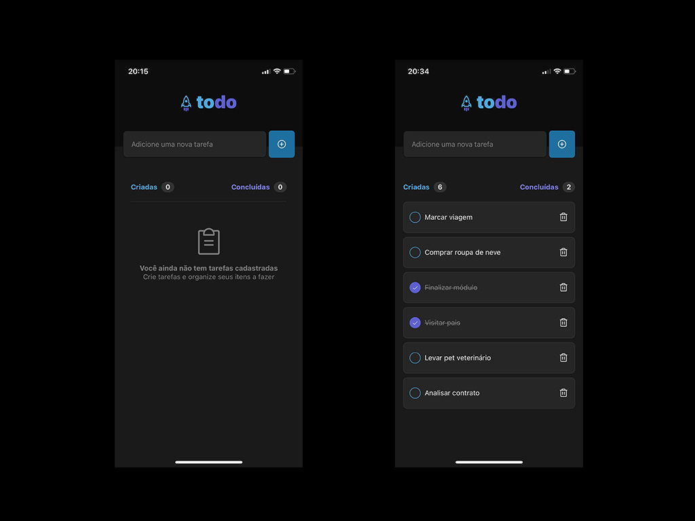

# Todo

First React Native module from Rocketseat One course.

## Layout

## Technologies

## How to use

**Install NodeJs packages**

    $ npm install

**Run project on local**

    $ npx expo start

## Referencies

**React Native**
https://reactnative.dev/

**Expo**
https://expo.dev/
